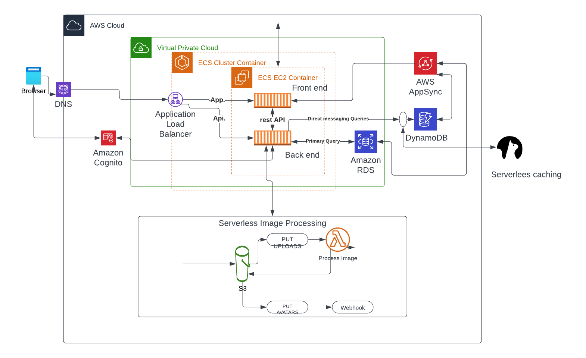

# Week 0 — Billing and Architecture

As a regular AWS user and Exampro studen for AWS Developer and Solutions Architect I already have credentials, billing alerts, and the AWS CLI installed and configured alongwith root account MFA secured, organisation, account user with password and MFA, create roles and keys etc 
## required homework

https://lucid.app/lucidchart/51634a8e-e3c8-4a29-8123-a40681a11ea5/edit?viewport_loc=173%2C29%2C1294%2C488%2C0_0&invitationId=inv_ab3ea303-a73b-4e19-b3c7-504ae76b31b8

